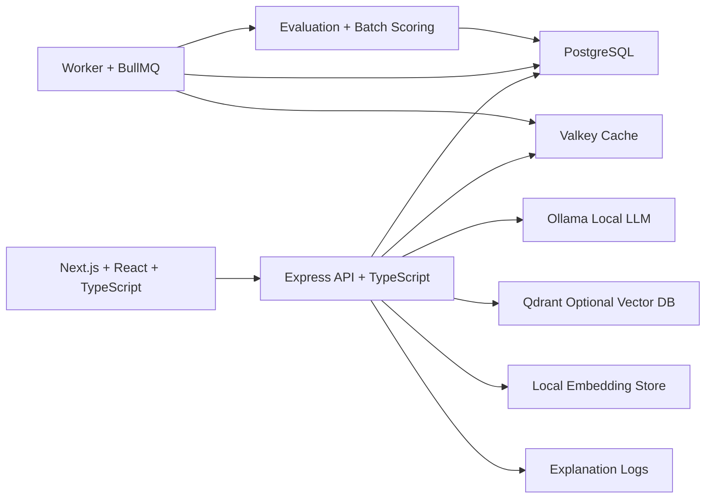

# RecoLab Architecture

## Development Phases

1. **Foundation:** Docker Compose starts PostgreSQL, Valkey, Ollama, optional Qdrant, API, worker, and web app.
2. **Data Model:** PostgreSQL stores users, items, ratings, interactions, model versions, recommendation results, evaluations, and AI explanation logs.
3. **Recommendation Engine:** Popularity, content-based, collaborative, and hybrid strategies are implemented in TypeScript.
4. **Semantic Retrieval Layer:** Ollama embeddings and deterministic local fallback vectors generate item embeddings. Qdrant is used when available; PostgreSQL vectors provide a local fallback.
5. **AI Explanation Layer:** Ollama generates natural-language “why this was recommended” text. A deterministic fallback keeps the app local and usable even before a model is pulled.
6. **Serving Layer:** Express routes expose auth, users, items, ratings, recommendations, feedback, admin metrics, model evaluation, embeddings, weights, and AI explanations.
7. **Performance Layer:** Valkey caches recommendation responses and BullMQ schedules background model refresh jobs.
8. **Experience Layer:** Next.js renders a recruiter-ready feed, profile page, item details, admin analytics, model charts, A/B simulation, semantic status, and explanation logs.

## Why This Shape

RecoLab separates ranking from explanation. Ranking should remain deterministic, measurable, and cacheable. AI text generation should be auditable and replaceable because LLM output quality can vary by local model size.
